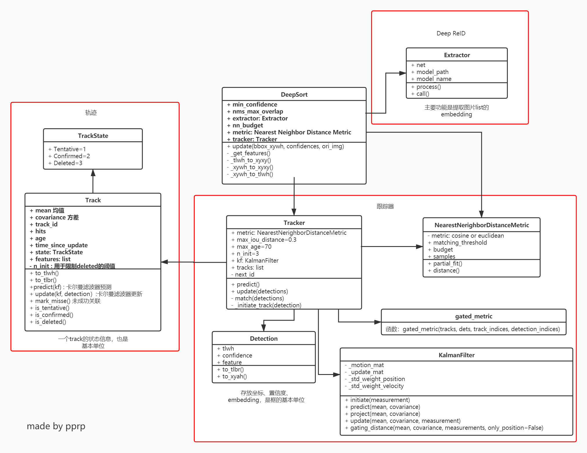
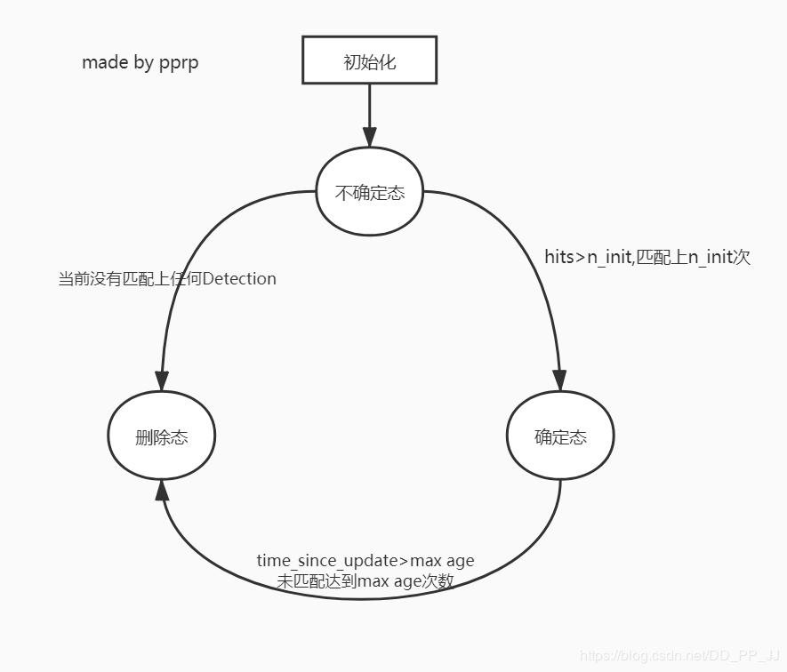
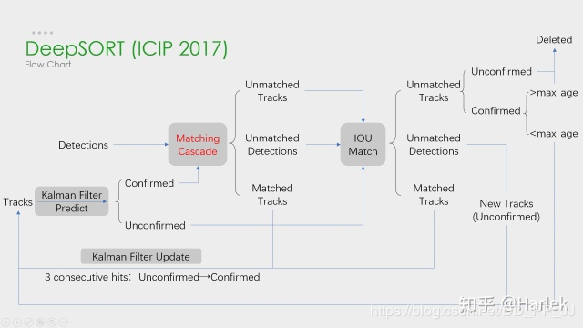

# DEEP SORT YOLOV3 PYTORCH

目标检测：基于U版yolov3（版本比较早，可以替换成改进的yolov5） https://github.com/ultralytics/yolov3 

ReID部分： https://github.com/pprp/reid_for_deepsort 

Deep SORT参考:  https://github.com/ZQPei/deep_sort_pytorch 

SORT参考： https://github.com/abewley/sort 

## 新特性

目标检测部分添加了常用的注意力模块CBAM, SE

添加了使用OpenCV进行目标跟踪的算法，第一帧使用YOLOv3进行检测。（在miniversion文件夹）

添加了SORT算法

完善ReID部分的训练

## 组织结构

cfg: cfg网络结构文件存放位置

data: sh文件，没什么用

deep_sort

 - deep: reid模块来自 https://github.com/pprp/reid_for_deepsort
 - sort： deep sort沿用了sort中的一些模块，是最核心的部分

miniversion: 使用cv2中的跟踪模块+yolov3进行跟踪，效果较差

sort: sort算法需要的依赖文件

utils: yolov3中的包

weights: yolov3权重存放位置

deep_sort.py: 仅仅通过运行deep_sort完成目标跟踪过程，保存跟踪的结果（视频文件）

detect.py: 沿用自yolov3,用于侦测目标。

pre_mot.py：进行跟踪，并将结果文件保存下来。

eval_mot.py: 对跟踪的结果文件进行评估，得到指标。

models.py: 沿用自yolov3,是模型构建的代码。

predict.py：沿用自yolov3,侦测单张图片。

sort.py: sort算法再次调用

train.py: 训练yolov3

test.py: 测试yolov3

## 代码注释

完整讲解《Deep SORT多目标跟踪算法代码解析》在GiantPandaCV公众号首发，欢迎关注。

主要提供了deep_sort文件夹中绝大部分代码的注释，以下是根据代码绘制的类图结构：

状态转移：

  

整体框架：

  

流程图：

  

